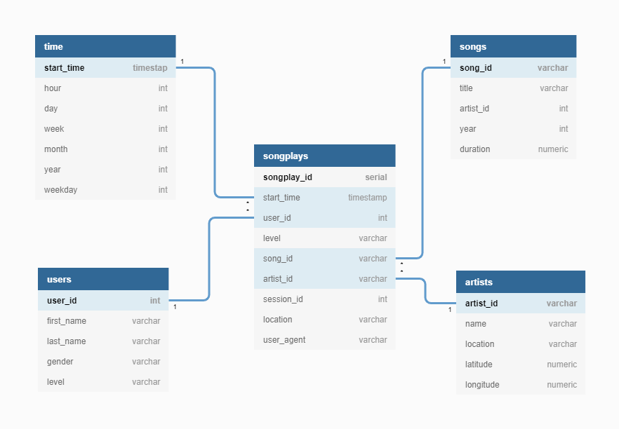

# Data modeling with Postgres
A startup called Sparkify wants to analyze the data they've been collecting on songs and user activity on their new music streaming app. The analytics team is particularly interested in understanding what songs users are listening to. Currently, they don't have an easy way to query their data, which resides in a directory of JSON logs on user activity on the app, as well as a directory with JSON metadata on the songs in their app.

They'd like a data engineer to create a Postgres database with tables designed to optimize queries on song play analysis. The role of this project is to create a database schema and ETL pipeline for this analysis. We will be also testing the database and ETL pipeline by running queries given by the analytics team from Sparkify and compare the results with their expected results.

## Project Description
In this project, we will model data with Postgres and build an ETL pipeline using Python. We will need to define fact and dimension tables for a star schema for a particular analytic focus, and write an ETL pipeline that transfers data from files in two local directories into these tables in Postgres using Python and SQL.

## Project Structure
The project includes the following files and folders:

```
├── README.md
├── create_tables.py
├── etl.ipynb
├── etl.py
├── requirements.txt
├── sql_queries.py
├── test.ipynb
├── data
│   ├── log_data
│   └── song_data
└── assets
```

- `README.md` - a markdown file giving an overview of the project and explaining the project structure
- `create_tables.py` - drops and creates database tables specified below. We run this file to reset the tables before each time we run the ETL scripts.
- `etl.ipynb` - reads and processes a single file from `song_data` and `log_data` and loads the data into the tables. This notebook contains detailed instructions on the ETL process for each of the tables.
- `etl.py` - reads and processes files from `song_data` and `log_data` and loads them into your tables. This is build out based on the work in the ETL notebook.
- `requirements.txt` - stores information about all the Python libraries, modules, and packages that are used in the  project. 
- `sql_queries.py` - contains all your sql queries, and is imported into the last three files above.


## Project Datasets

### Song Dataset
The first dataset is a subset of real data from the [Million Song Dataset](http://millionsongdataset.com/). Each file is in JSON format and contains metadata about a song and the artist of that song. The files are partitioned by the first three letters of each song's track ID. For example, here are file paths to two files in this dataset.

```
song_data/A/B/C/TRABCEI128F424C983.json
song_data/A/A/B/TRAABJL12903CDCF1A.json
```

And below is an example of what a single song file, TRAABJL12903CDCF1A.json, looks like.

```
{"num_songs": 1, "artist_id": "ARJIE2Y1187B994AB7", "artist_latitude": null, "artist_longitude": null, "artist_location": "", "artist_name": "Line Renaud", "song_id": "SOUPIRU12A6D4FA1E1", "title": "Der Kleine Dompfaff", "duration": 152.92036, "year": 0}
```

### Log Dataset
The second dataset consists of log files in JSON format generated by this event simulator based on the songs in the dataset above. These simulate activity logs from a music streaming app based on specified configurations.

The log files in the dataset we'll be working with are partitioned by year and month. For example, here are filepaths to two files in this dataset.

```
log_data/2018/11/2018-11-12-events.json
log_data/2018/11/2018-11-13-events.json
```

And below is an example of what the data snippet in a log file, 2018-11-12-events.json, looks like.

```
{"artist":null,"auth":"Logged In","firstName":"Kevin","gender":"M","itemInSession":0,"lastName":"Arellano","length":null,"level":"free","location":"Harrisburg-Carlisle, PA","method":"GET","page":"Home","registration":1540006905796.0,"sessionId":514,"song":null,"status":200,"ts":1542069417796,"userAgent":"\"Mozilla\/5.0 (Macintosh; Intel Mac OS X 10_9_4) AppleWebKit\/537.36 (KHTML, like Gecko) Chrome\/36.0.1985.125 Safari\/537.36\"","userId":"66"}
{"artist":"Fu","auth":"Logged In","firstName":"Kevin","gender":"M","itemInSession":1,"lastName":"Arellano","length":280.05832,"level":"free","location":"Harrisburg-Carlisle, PA","method":"PUT","page":"NextSong","registration":1540006905796.0,"sessionId":514,"song":"Ja I Ty","status":200,"ts":1542069637796,"userAgent":"\"Mozilla\/5.0 (Macintosh; Intel Mac OS X 10_9_4) AppleWebKit\/537.36 (KHTML, like Gecko) Chrome\/36.0.1985.125 Safari\/537.36\"","userId":"66"}
{"artist":null,"auth":"Logged In","firstName":"Maia","gender":"F","itemInSession":0,"lastName":"Burke","length":null,"level":"free","location":"Houston-The Woodlands-Sugar Land, TX","method":"GET","page":"Home","registration":1540676534796.0,"sessionId":510,"song":null,"status":200,"ts":1542071524796,"userAgent":"\"Mozilla\/5.0 (Windows NT 6.3; WOW64) AppleWebKit\/537.36 (KHTML, like Gecko) Chrome\/36.0.1985.143 Safari\/537.36\"","userId":"51"}
```

## Data Modelling



## Getting Started

### Dependencies

You will need to install all Python dependencies that are stored in the [requirements.txt](requirements.txt) file. 

To install them, first open a terminal window in the folder of this repository and create & activate a virtual environment: 

```bash
python3 -m venv .venv
source .venv/bin/activate
```

Then install the dependencies from the [requirements.txt](requirements.txt) file:

```bash
pip install -r requirements.txt 
```

### Database Setup

In this section, we describe how to start a PostgreSQL server. The instructions apply to Linux and the first step is to install PostgreSQL

```bash
sudo apt-get update
sudo apt-get install postgresql
```

Next start the PostgreSQL server by typing:

```bash
sudo service postgresql start
```

Once the postgres server is up and running, the next step is to configure it for use. Run the following command:

```bash
psql postgres
```

We have logged into the postgres service and now ready to execute psql commands. We are going to create a new user that will have the privileges to create and manage databases within the service. You can execute the command as follows to create the new user with the right access:

```bash
CREATE ROLE student WITH LOGIN PASSWORD 'student';
ALTER ROLE student CREATEROLE CREATEDB;
```

The second command gives the role the ability to create new databases.

Once the new user is created, you can check that it's available by typing the following command:

```bash
postgres=# \du
                                   List of roles
 Role name |                         Attributes                         | Member of 
-----------+------------------------------------------------------------+-----------
 postgres  | Superuser, Create role, Create DB, Replication, Bypass RLS | {}
 student   | Create DB                                                  | {}
```

Use the following statement to create a new database named studentdb in the PostgreSQL database server, which will be used initially in the scripts of this project:

```bash
CREATE DATABASE studentdb;
```

or use this one from the command line before loging into psql:

```bash
createdb -U postgres studentdb
```

### Running the ETL Pipeline

1. In order to create the database tables run the following command in the terminal
    ```bash
    python create_tables.py
    ```

2. Loading, transforming and processing the raw datasets is done by running the next command:
    ```bash
    python etl.py
    ```

3. To test that the database tables are populated with the right data records, open `etl.ipynb ` in jupyter notebook as follows:
    ```bash
    jupyter notebook etl.ipynb 
    ```

If you would like to repeat the steps above, remember to run `create_tables.py` before running `etl.py` to reset your tables.
